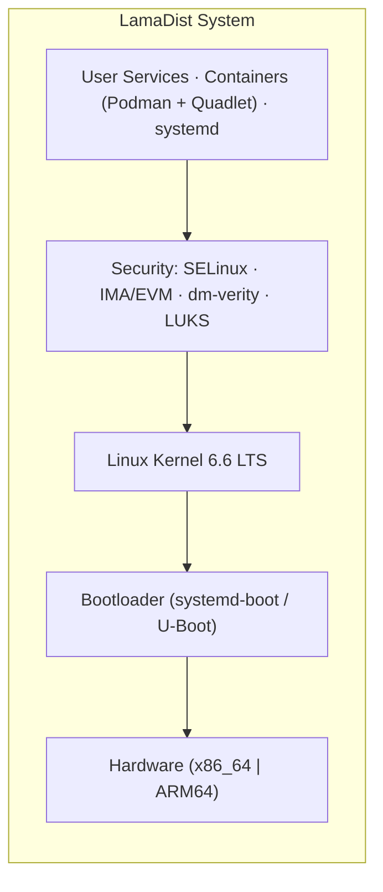

<!-- SPDX-License-Identifier: Apache-2.0 -->
<p align="center">
  
</p>

# LamaDist

**A secure, maintainable Yocto/OpenEmbedded distribution for homelab
devices**

LamaDist is a hardened Linux distribution built with the Yocto
Project for homelab infrastructure: unattended home servers, NAS
boxes, edge compute nodes, and container workload hosts.  Devices
run immutable images built on a workstation or CI runner; the
security architecture (SELinux, dm-verity, LUKS, TPM-backed measured
boot) and RAUC-based OTA updates are being built out milestone by
milestone.

## Features

Split into what works today and what is planned.  See
[`docs/PLAN.md`](docs/PLAN.md) for the milestone roadmap and an
honest snapshot of the current state.

### Current

- 📦 **Reproducible Builds**: declarative KAS configuration built in
  OCI containers (Podman), with dependency lockfiles
- 🛠️ **Full Task Suite**: mise tasks for building, static analysis,
  artifact tests, QEMU boot, and build statistics
- 🔒 **Security Groundwork**: build-time configuration for SELinux
  (refpolicy-targeted), IMA/EVM RPM signing, a dm-verity image class
  (x86_64), and LUKS wiring
- 📋 **Supply-chain Visibility**: SPDX SBOM generation and CVE
  scanning in every build
- 🎯 **Minimal & Optimized**: lean system with size-optimized builds
  (`-Os`)

### Roadmap

- 🖥️ **Usable Base Image**: serial and ssh login, DHCP networking,
  persistent journal (M1)
- 🔄 **Atomic Updates**: RAUC-based A/B OTA updates with automatic
  rollback (M3)
- 🛡️ **Enforced Hardening**: UEFI Secure Boot, measured boot with
  TPM2-sealed LUKS, enforcing SELinux, dm-verity with UKI, EROFS
  (M4)
- 🚀 **Container Workloads**: Podman with Quadlet (systemd units);
  cluster orchestration is deferred future work
- 💪 **Multi-platform**: ARM parity starting with the Radxa RK1,
  then SOQuartz and Orin NX (M5)
- 🏷️ **Release Engineering**: signed, versioned releases with
  published SBOMs (M6)

## Quick Start

### Prerequisites

- Linux system (Ubuntu 22.04+ recommended) or WSL2
- [mise](https://mise.jdx.dev/) (polyglot tool manager and task runner)
- [podman](https://podman.io/) or Docker
- 8+ GB RAM, 100+ GB free disk space (SSD recommended)

### Build Your First Image

```bash
# Clone the repository
git clone https://github.com/LamaGrid/lamadist.git
cd lamadist

# Trust the mise config (required for MISE_PARANOID=1 users)
mise trust

# Install tools (mise manages everything)
mise install

# Build image (2-6 hours on first build)
mise run build --bsp x86_64

# Images will be in: build/tmp/deploy/images/intel/
```

> **Paranoid mode**: LamaDist's `.mise.toml` is compatible with
> `MISE_PARANOID=1`. After cloning (or after any `.mise.toml` change), run
> `mise trust` to approve the config.

### Supported Hardware (BSPs)

- **x86_64**: Intel-based systems -- the reference platform
  (`mise run build --bsp x86_64`)
- **rk1**: Radxa RK1 -- builds an upstream image today; LamaDist
  port planned (M5)
- **soquartz**: Pine64 SOQuartz -- builds an upstream image today;
  LamaDist port planned (M5)
- **orin-nx**: NVIDIA Jetson Orin NX -- experimental; direction
  decided in M5

## Documentation

Comprehensive documentation is available in the [`docs/`](docs/) directory:

- **[Development Plan](docs/PLAN.md)** - Milestone roadmap and current state
- **[Architecture](docs/ARCHITECTURE.md)** - System architecture and design
- **[Partitioning](docs/PARTITIONING.md)** - Disk partitioning layouts and update strategy
- **[Contributing](docs/CONTRIBUTING.md)** - Contribution guidelines and workflow
- **[Tooling](docs/TOOLING.md)** - Tools, setup, and build system guide

### Key Commands

```bash
mise tasks                      # list available tasks
mise run build --bsp x86_64     # build for x86_64
mise run check                  # static analysis + KAS validation
mise run test                   # validate build artifacts
mise run vm                     # boot the built image in QEMU
mise run kas --bsp x86_64       # interactive KAS shell
mise run inspect --bsp x86_64   # dump KAS configuration
mise run info                   # show build version information
```

See [`docs/TOOLING.md`](docs/TOOLING.md) for detailed usage information.

## Project Status

**Current Milestone**: M0 (Truth Reset) -- making the documentation
match reality and tidying the repository.  Next up is M1, a usable
base image.

LamaDist is in active development and not yet usable on real
devices.  See [`docs/PLAN.md`](docs/PLAN.md) for the complete
milestone roadmap.

## Architecture Overview



See [`docs/ARCHITECTURE.md`](docs/ARCHITECTURE.md) for detailed architecture information.

## Contributing

Contributions are welcome! Please read [`docs/CONTRIBUTING.md`](docs/CONTRIBUTING.md) for:

- Development workflow
- Branch naming and commit message conventions
- Pull request process
- Code review expectations
- Yocto/OE best practices

## Community & Support

- **Issues**: [GitHub Issues](https://github.com/LamaGrid/lamadist/issues)
- **Discussions**: [GitHub Discussions](https://github.com/LamaGrid/lamadist/discussions)
- **Documentation**: [`docs/`](docs/) directory

## Legal Notice

   Copyright 2024-2026 Lucas Yamanishi

   All content licensed under the Apache License, Version 2.0 (the "License");
   you may not use these files except in compliance with the License.
   You may obtain a copy of the License at

       http://www.apache.org/licenses/LICENSE-2.0

   Unless required by applicable law or agreed to in writing, software
   distributed under the License is distributed on an "AS IS" BASIS,
   WITHOUT WARRANTIES OR CONDITIONS OF ANY KIND, either express or implied.
   See the License for the specific language governing permissions and
   limitations under the License.
